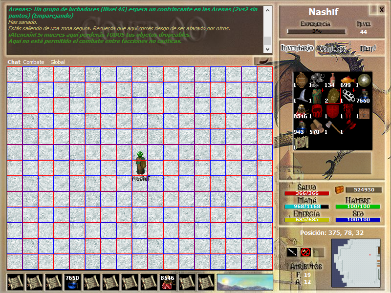

## Detalles técnicos

A continuación voy a dar algunos detalles básicos de los conceptos técnicos mas importantes que componen al Argentum y
brindar soluciones a los problemas que surjan.

### Tiles

El tamaño del tile (lógico, a nivel de código) es de 32x32, el gráfico del pasto es de 128x128, es decir ocupa 4x4
tiles. Esto sirve para disimular las repeticiones en el patrón y mejorar el aspecto visual.

### Render

Un dato menor, es que la primera resolución de argentum fue (y se sigue utilizando aunque cueste creerlo) de 800x600
pixeles, siendo esta una relación de aspecto 4:3 que encajaba con los monitores de tubos catódicos del mismo tamaño,
logrando ejecutar el juego en pantalla completa sin que este perdiera calidad. Hoy en día, se utilizan diferentes
resoluciones y tamaños de pantalla, lo que hace que el juego tenga que adaptarse (con programación y diseño) a nuevos
cambios para mejorar la calidad grafica, pero eso es otro tema que voy a explicar mas adelante.

Para renderizar el mapa del juego se utilizan tiles de 32x32 pixeles, y teniendo en cuenta la resolución 800x600, solo
se llegan a visualizar 17 en el eje x e 13 en el eje y dentro del mapa. El espacio sobrante del render pertenece a la
interfaz (consola, inventario, etc.).

Esta imagen muestra la cantidad de tiles que ocupa el render del mapa. Los personajes ocupan dos grillas verticales.
Esto se debe a que la suma del cuerpo (37px) mas la cabeza **incrustada** (11px de los 13px que ocupa) da un alto de
48px. Para clicks el tile importante es el de arriba ("la cabeza") y para colisiones el tile importante es el de los
pies.

### Relación de tamaño entre resolución y tile

Hoy en día se utilizan monitores de 1920x1080 (16:9) o resoluciones similares. Esto significa que utilizar tiles de
32x32 en estas resoluciones de gran tamaño con un render de 17x13 tiles, afecta el aspecto visual de los graficos ya
que estos se "pixelean" y estiran a la vista del jugador. En caso contrario, utilizar una resolución pequeña en
pantallas grandes haría el render muy chico. El render se puede estirar o achicar dependiendo de la resolución, pero la
cantidad de tiles dentro de la vista del jugador siempre va a ser la misma (lógicamente), por eso se estiran o achican
con estos cambios para mantener esa cantidad. En otras palabras, si ejecutas el Argentum en pantalla completa en un
monitor con resolución 1920x1080, se va a ver horrendo, pero vas a estar viendo lo mismo que la persona que lo ejecuta
en un fósil informático que utiliza una resolución 800x600. Por lo tanto, lo ideal seria cambiar el tamaño a tiles de
64x64 para darle mas detalles a estos y poder hacer animaciones un poco mas estéticas. Aunque esto no termina de
solucionar todos los problemas, ya que es falso que la mayoría de los usuarios usan resoluciones 1920x1080. Las
resoluciones 1366x768 y 1024x768 (proporciones 4:3) son MUY usadas, principalmente en Notebooks, y para esa altura (64),
no llegan ni a los 13 tiles verticales de la resolucion 800x600. Por lo que parece ser mejor usar tiles de 48x48.

La otra opción es remasterizar gráficamente el juego por completo para que la resolución por defecto esté pensada en
1920x1080 y desde ahi escalar los gráficos hacia abajo, donde casi no pierden calidad. Aunque es una buena idea escalar
las imagenes originales x2 utilizando redes neuronales (con poca perdida de calidad) para evitar tener que regraficar
todo. La unica desventaja es que aunque se hayan escalado bien, el grafico ya es demasiado plano en resoluciones muy
grandes. Por lo tanto, una solucion a esto es cambiar la perspectiva de los personajes y los graficos en general, es
abismal el impacto que genera ver un personaje o ambiente como si fuera en diagonal "desde arriba" que acostado 100%
plano como se hizo siempre en AO, además de que te permite agregarle una sombra mucho más sutil.

Otra idea interesante (y nose si la mejor) es implementar la *niebla de guerra* para que el juego se adapte a cualquier
resolución sin "romper" el formato clásico, permitiendo ver solo los graficos pero no los mobs/personajes.

### Cámara

Con respecto a la cámara que es de tipo top-down, solo se dibujan los tiles que estan dentro de esta, evitando
renderizar todos los tiles que ocupa el mapa de 100x100 tiles.

### Estilo artístico
